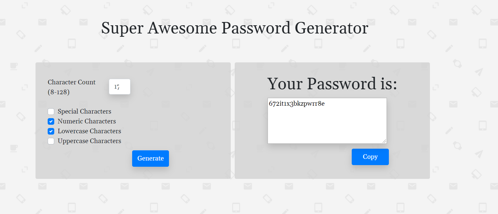

# Password-Generator
 https://greichman.github.io/password-generator/  
By: Garrett Reichman

## Description
  This project was made to learn how to combine javascript and html/css to make a usable tool for password generation. It uses html and bootstrap to obtain the user's preferences for their passwords contents, then generates a random password that meets these qualifications. The user is then able to copy the password to their clipboard for use elsewhere.
  
## Usage
  To begin using the generator, fill in the form on the right side of the page (or upper section on mobile) with how long you would like the password to be and which character sets you would like to be included. Once finished, hit the "Generate" button to create and display the password on the right (upper) section. Finally, click the "Copy" button if you would like to copy the generated password to your computer's clipboard.  

